# Hotel Booking Api
***


***
* Bu uygulamayı EtsTur Java Developer Bootcamp final projesi için yaptım.
* Readme içine Uml diyagramını, H2Console arayüzünü, Swagger arayüzünü, 
müşteriler için geliştirdiğim basit bir Thymeleaf arayüzünü ekledim. 
* Spring Security ile uygulama güvenliğini oluşturdum. 
* Servis teslerini JUnit5 ile yaptım. Servislerim için %80 method covarage sağladım. 
* Uygulamadan kısaca bahsetmem gerekirse Entity'ler ve verileri almak için Dto'larını 
oluşturdum. İşlemleri genel olarak servis katmanı içinde yapsam da sınıflara özgü olan 
metotlarımı ilgili Entity'ler içinde oluşturdum. Jpa Relationship'lerlerinden OneToMany,
ManyToOne, OneToOne ilişkilerinin hepsinin projemde olmasını istediğim için Entity'lerimi 
doğru yapıdaki ilişkiler ile birbirine bağlamaya çalıştım. 

***
* Tanıtım videosunu ilgili linkten izleyebilirsiniz
* https://www.loom.com/share/b640fc78d0d74e24b375fb8b8a09877e
***
UML DIAGRAM : 
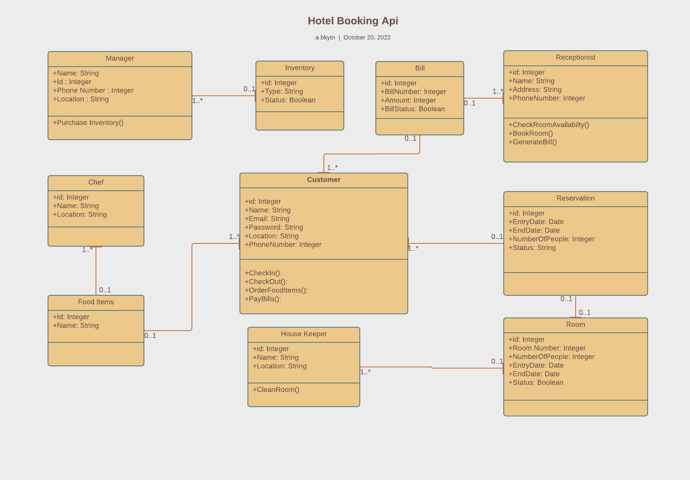
***

### Rest Controller
- ChefController, CustomerController, HouseKeeperController,
- ManagerController, ReceptionistController, GeneralController

***
### Thymeleaf Controller
- CustomerRegistrationController, CustomerMainController

***
### Services
- ChefService, CustomerService, HouseKeeperService
- ManagerService, ReceptionistService, GeneralService
***

```
```

* H2Database :

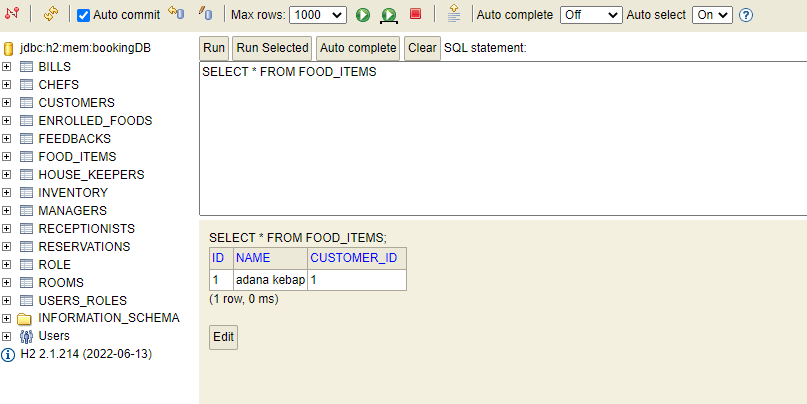
```
```

* Swagger :

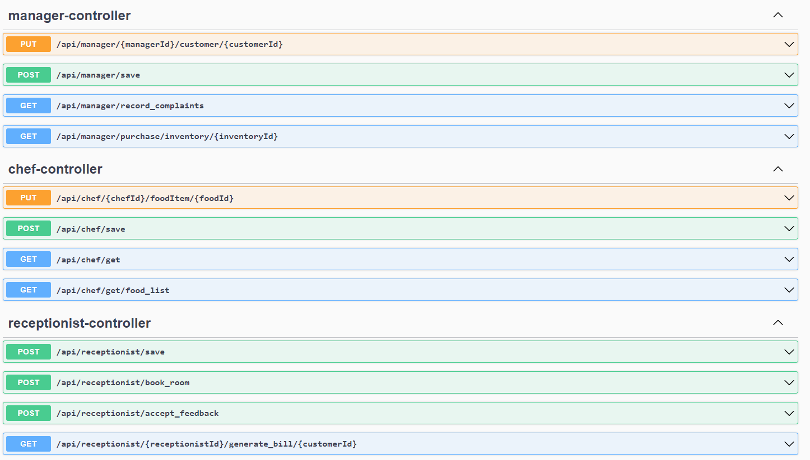

* Swagger Jpa Relationship Örnek Gösterim : 

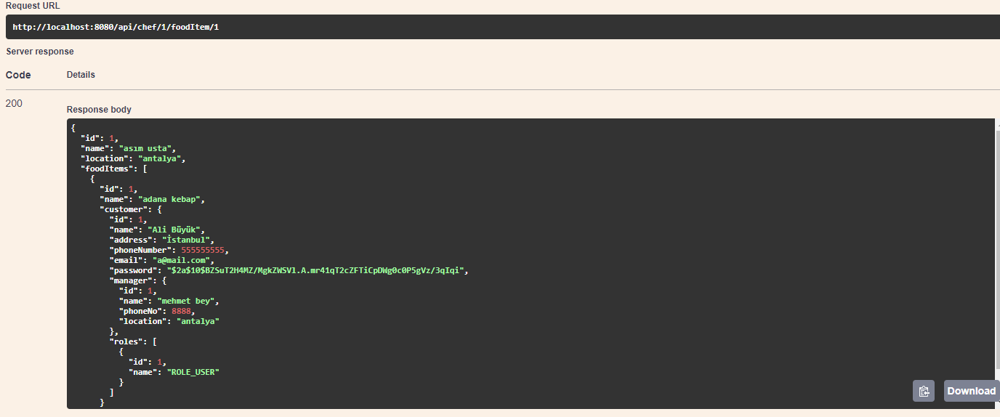
```
```

* Thymeleaf Ekranları (Müşteriler için): 

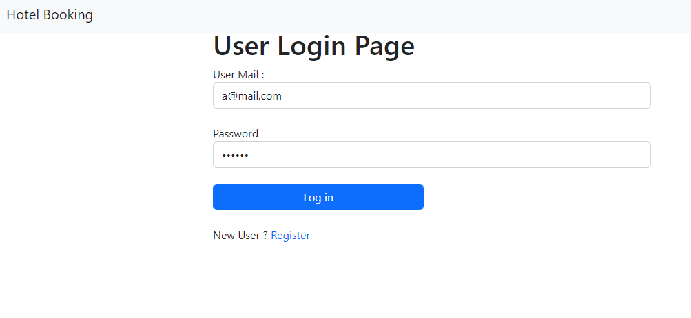
***
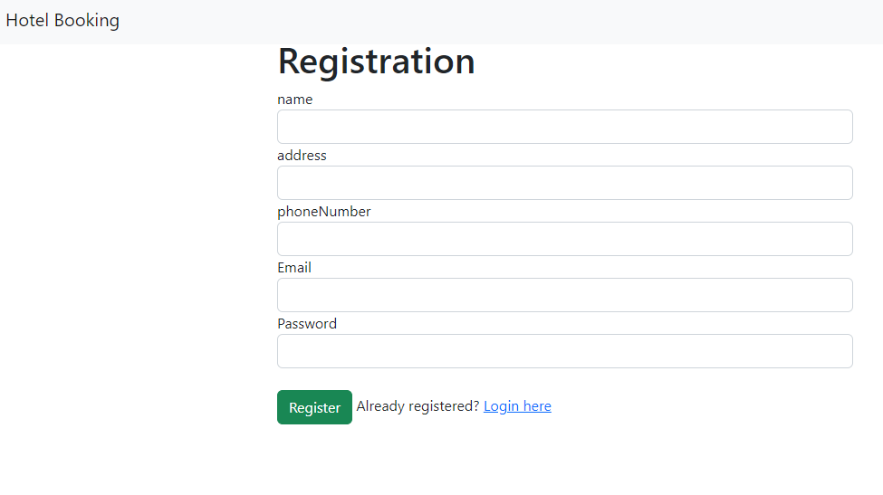
***
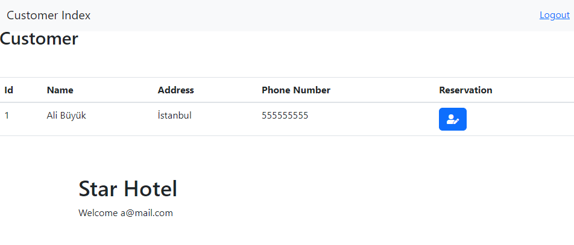
***
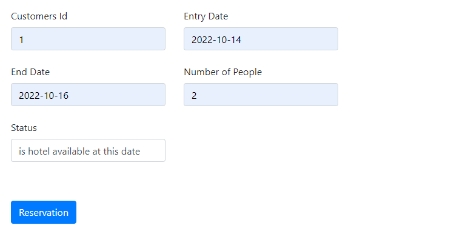
***
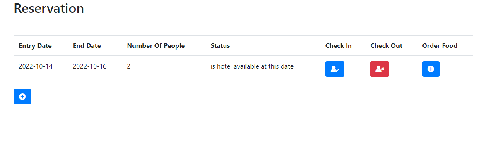
***
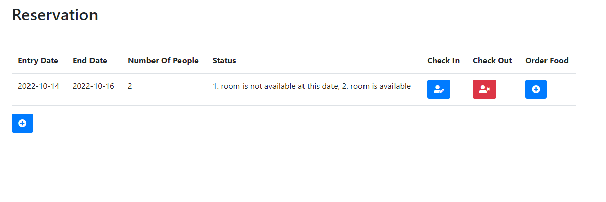
***
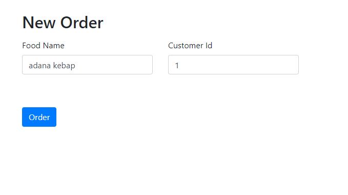

